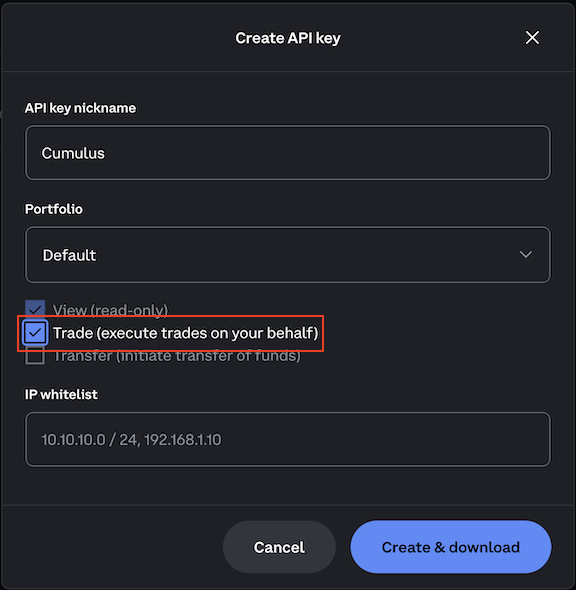

# cumulus

A script to dollar-cost average cryptocurrency with the Coinbase Advanced Trade APIs

## Getting started

### Create an API Key

To use the Advanced Trade APIs, you must create an API key. Note that Coinbase Pro keys are no longer supported. Follow the instructions in the [Getting Started with Advanced Trade APIs](https://docs.cdp.coinbase.com/advanced-trade/docs/getting-started) guide.

Ensure that you have the "Trade" permission checked for your API key.



1. After setting the permissions, click the **Create & download** button to generate your API key. This will download a file named `cdp_api_key.json`.

2. Create a folder named `secrets` in your project directory.

3. Place your `cdp_api_key.json` file inside the `secrets` folder. This file should contain your API key and secret.


### Setting Up Python and Virtual Environment

1. Navigate to your project directory (e.g., `/home/<user>/cumulus`).
2. Create a virtual environment by running:

   ```bash
   python -m venv venv
   ```

   This will create a folder named `venv`, which is ignored by `git`.

3. Activate the virtual environment:
   - On macOS/Linux:

     ```bash
     source venv/bin/activate
     ```

   - On Windows:

     ```bash
     venv\Scripts\activate
     ```

4. Install the required dependencies within the virtual environment:

   ```bash
   pip install -r requirements.txt
   ```

### Edit the Trading Plan

1. Create a trading plan file named `trading_plan.yml` in your project directory. You can use the provided template `trading_plan.yml.template` as a starting point.
2. Specify the amount in USD to spend on each cryptocurrency in the `trades` section of the `trading_plan.yml` file. For example:

   ```yaml
   trades:
     ETH: $10.00
     BTC: $10.00
     SOL: $10.00 
   ```

*Note: YAML is picky about spacing, so ensure your indentation stays consistent.*

For assets available on Coinbase Exchange, please [go here](https://exchange.coinbase.com/markets).

### Running Cumulus

Cumulus is now installed, configured, and ready to run. By default, the script runs in **sandbox mode**. To execute it in **production mode**, use the `-p` or `--production` flag. You can execute the script manually by entering:

```bash
./cumulus.py
```

or

```bash
python cumulus.py
```

To run in production mode:

```bash
./cumulus.py -p
```

or

```bash
python cumulus.py --production
```

### Setting Up a Cron Job

To automate the execution of Cumulus, set up a cron job using `crontab -e` to run the script at your desired interval. Remember that the script runs in **sandbox mode** by default, so if you want it to run in **production mode**, include the `-p` or `--production` flag in your cron job command. You can use [this online cron expression generator](https://crontab.cronhub.io) for assistance.

#### Examples

- To run the script every Friday at 6:00 AM server time in production mode:

  ```bash
  0 6 * * 5 /path/to/cumulus/venv/bin/python /path/to/cumulus/cumulus.py -p
  ```

- To run the script every minute in sandbox mode:

  ```bash
  * * * * * /path/to/cumulus/venv/bin/python /path/to/cumulus/cumulus.py
  ```

- To run the script every minute in production mode:

  ```bash
  * * * * * /path/to/cumulus/venv/bin/python /path/to/cumulus/cumulus.py -p
  ```

### Profit!

