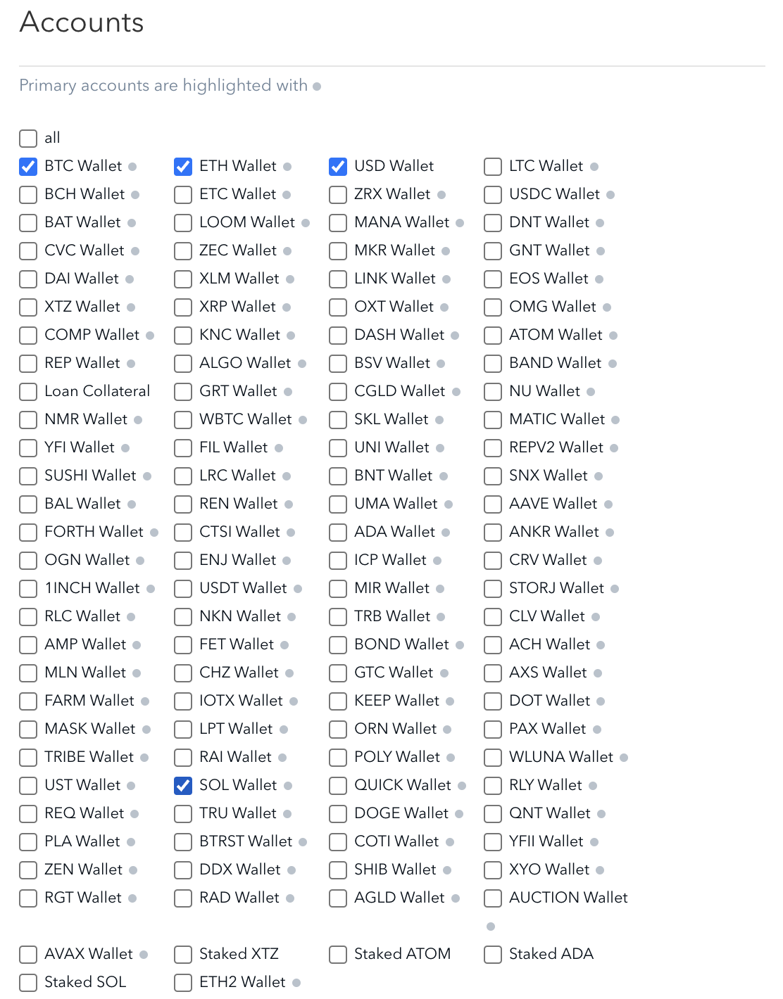
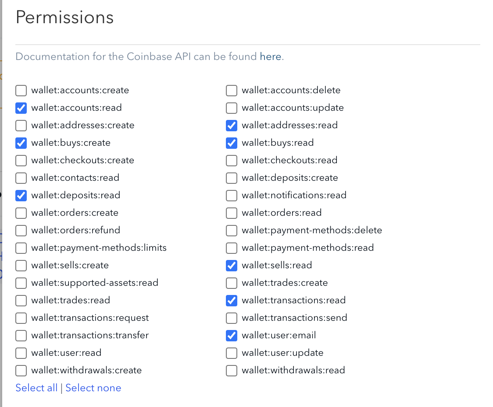

# cumulus

A script to dollar-cost average cryptocurrency with the Coinbase Advanced Trade API

## Getting started

### Create a new API key

To trade on Coinbase Advanced Trade, you must create a new API key (and cannot use your Coinbase Pro keys). See [How to Create a new API Key](https://docs.cloud.coinbase.com/advanced-trade-api/docs/migration#how-to-create-a-new-api-key) for instructions.

Permissions are a lot more granular than before. Check each wallet type under **Accounts** that you intend to use for buying. The below screenshot matches what's needed for the example config.

I toggled the following permissions, but not all are used for this particular script. You can copy mine or set your own. Just ensure you're able to read/write buys.

Save and be sure to write down the passphrase and the secret because you won't be able to view them again.

### Git & GitHub

1. Check that you have `git` installed by running `git` in the terminal. If it's installed, move on to the next step. If your system returns `git: command not found,` install `git` with `sudo apt-get install git`

1. Next, generate an SSH key by typing `ssh-keygen -t ed25519` You can choose whether or not to use a passphrase. This key will be used to pull the code from GitHub to your server.

1. Send me your **public key**

1. Once I've added your public key to the list of deploy keys, go to the directory where where you want cumulus installed and run, `git clone git@github.com:johnzimmerman/cumulus.git` This will download the source code to your computer.

### Python, venv, and requirements.txt

1. Navigate to your project directory (e.g. `/home/<user>/cumulus`) and enter `python -m venv venv` This will create a virtual environment folder `venv`, which is ignored by `git`.

1. Activate the virtualenv with `source venv/bin/activate`

1. Install the dependencies within the virtualenv: `pip install -r requirements.txt`

### Edit the config file

1. Copy—don't just rename—the included example config file, `config.yml.example`, to `config.yml`. Your config file will be ignored by `git` and will remain on your system only.

1. Edit the config file. *Note: YAML is picky about spacing, so ensure your indentation stays consistent.*
    - Enter your API key and secret.
    - Enter the coins you want to buy and how much of each. You can add as many or as little as you like.

Cumulus is now installed, configured, and ready to run. Enter `./cumulus.py` or `python cumulus.py` to run it manually.

### Setup your cron

Next, set a cron job using `crontab -e` to run cumulus at your desired interval. Visit https://crontab.cronhub.io for a quick and simple editor that will help you build your cron expression.

#### Examples

1. `0 6 * * 5 /path/to/cumulus/venv/bin/python /path/to/cumulus/cumulus.py` - Runs 6:00 am server time every Fri

1. `* * * * * /path/to/cumulus/venv/bin/python /path/to/cumulus/cumulus.py` - Runs every min

### Profit!

## Helpful links

- [Introduction to Advanced Trade API](https://docs.cloud.coinbase.com/advanced-trade-api/docs/welcome)
- [Postman API Client](https://www.postman.com/product/api-client/) - Test API calls
